# 保险 Agent 智能体系统 — Mermaid 架构图集

---

## 1. Agent 整体流程框架

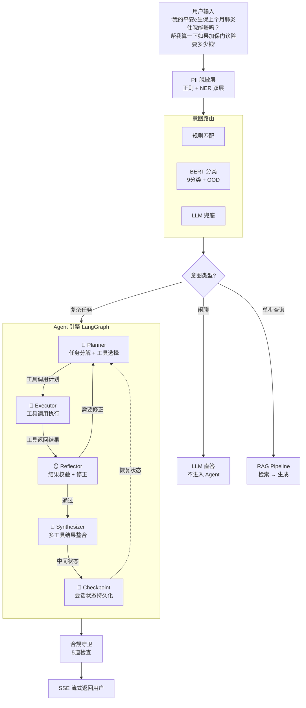

---

## 2. Planner-Executor 状态图

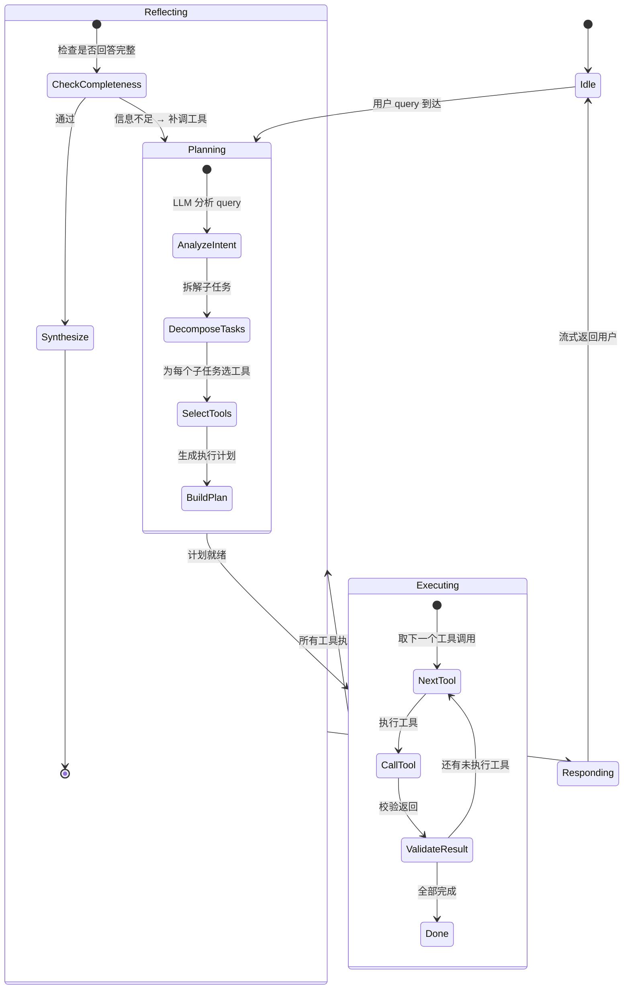

---

## 3. LangGraph 节点与边

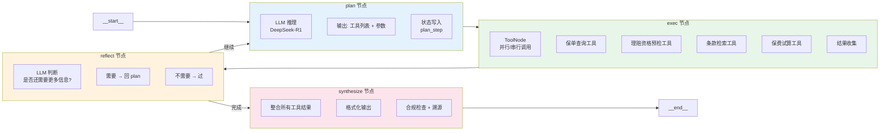

---

## 4. 7个工具定义

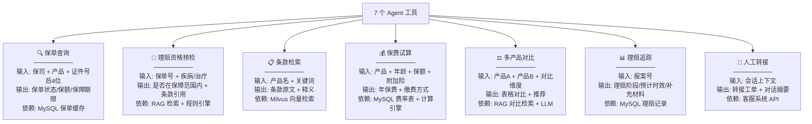

---

## 5. 复杂多工具编排示例

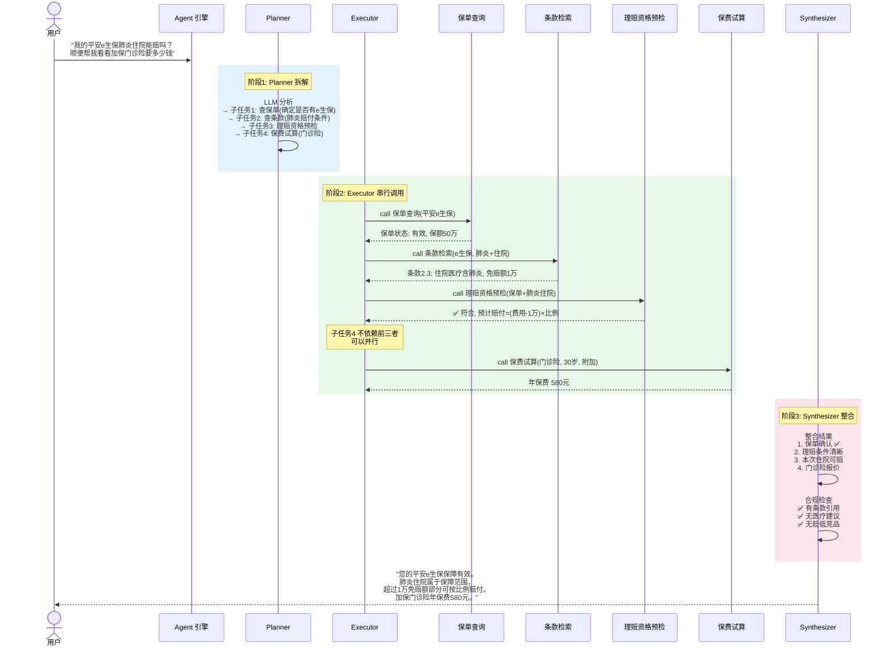

---

## 6. Checkpoint 双层记忆系统

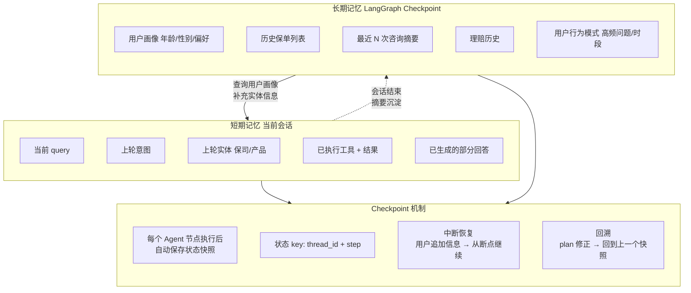

---

## 7. 多轮对话状态流转

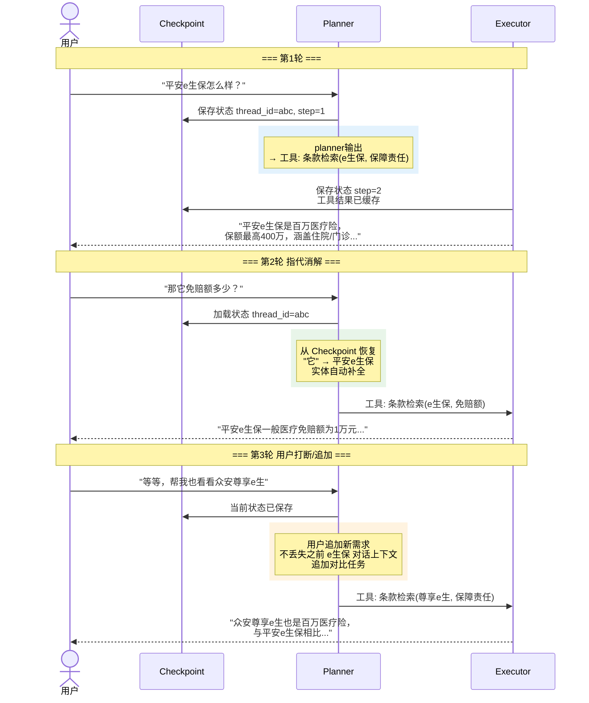

---

## 8. 工具调用并行/串行决策

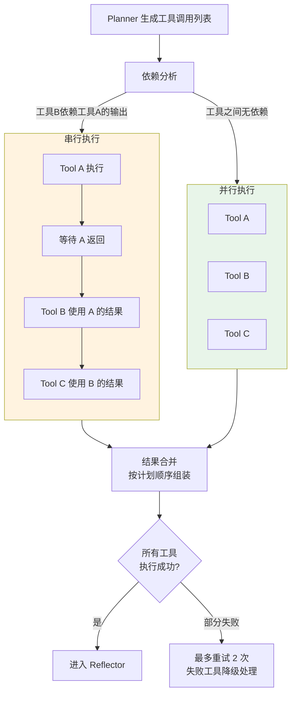

---

## 9. Agent 故障降级链路

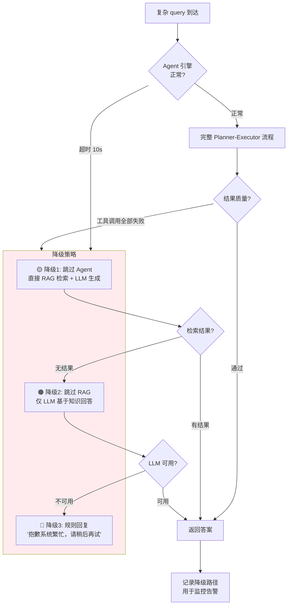

---

## 10. Agent 与 RAG 的协作关系

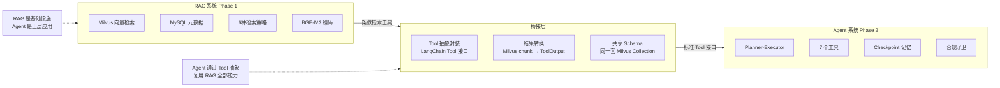

---

## 11. 工具注册与 LangChain 集成

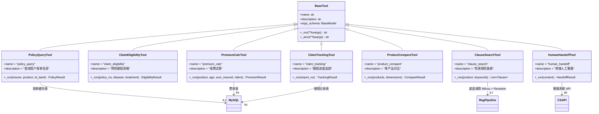

---

## 12. 端到端延迟分解 Agent 场景

```mermaid
gantt
    title Agent 复杂任务端到端延迟 ~2500ms (5个工具)
    dateFormat X
    axisFormat %s

    section 前置
    PII 脱敏             :pii, 0, 1
    意图路由              :router, 1, 6

    section Planner
    LLM 任务分解 DeepSeek-R1 :plan, 6, 506

    section Executor 工具调用
    保单查询 MySQL        :t1, 506, 556
    条款检索 Milvus       :t2, 556, 606
    理赔资格预检           :t3, 606, 706
    保费试算               :t4, 706, 756
    产品对比检索           :t5, 756, 856

    section 后置
    Reflector 校验         :reflect, 856, 956
    Synthesizer 整合       :synth, 956, 1756
    合规检查               :comply, 1756, 1758
    流式返回               :stream, 1758, 2500
```

---

## 使用说明

在支持 Mermaid 的编辑器中直接渲染，或粘贴到 https://mermaid.live 预览。

文件位置: `/home/newnew/code/code/pythonCode/python_learning/integrated_qa_system/AGENT_MERMAID.md`
