# 保险智能问答系统 - 完整项目流程图 (v3.2 记忆管理)

> PII 脱敏/还原由 Spring 网关完成。Python 侧新增长短记忆: RedisSaver Checkpoint + MySQL 用户画像。

## 图1: 系统总览 (Top-Level)

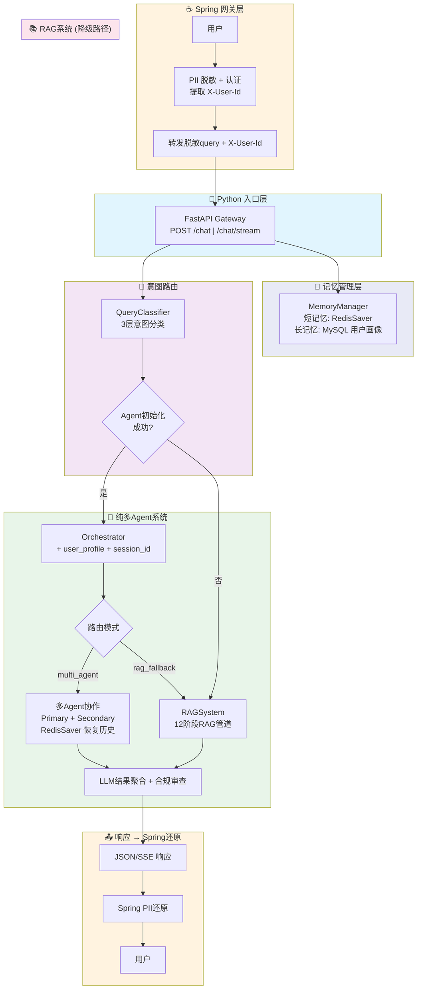

## 图2: 完整请求处理流程 (端到端)

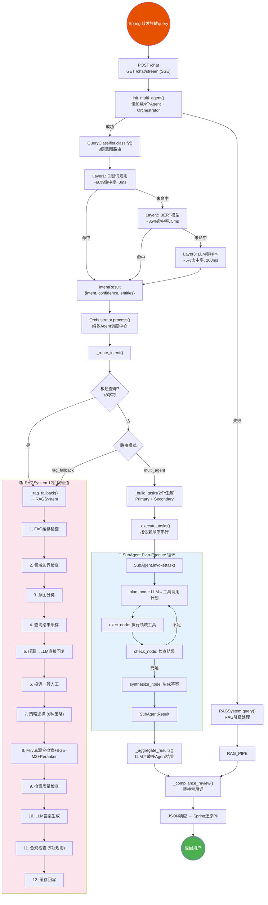

## 图3: 多Agent编排流程 (Orchestrator 核心)

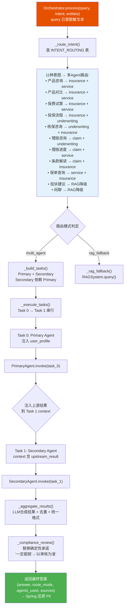

## 图4: SubAgent Plan-Execute 循环

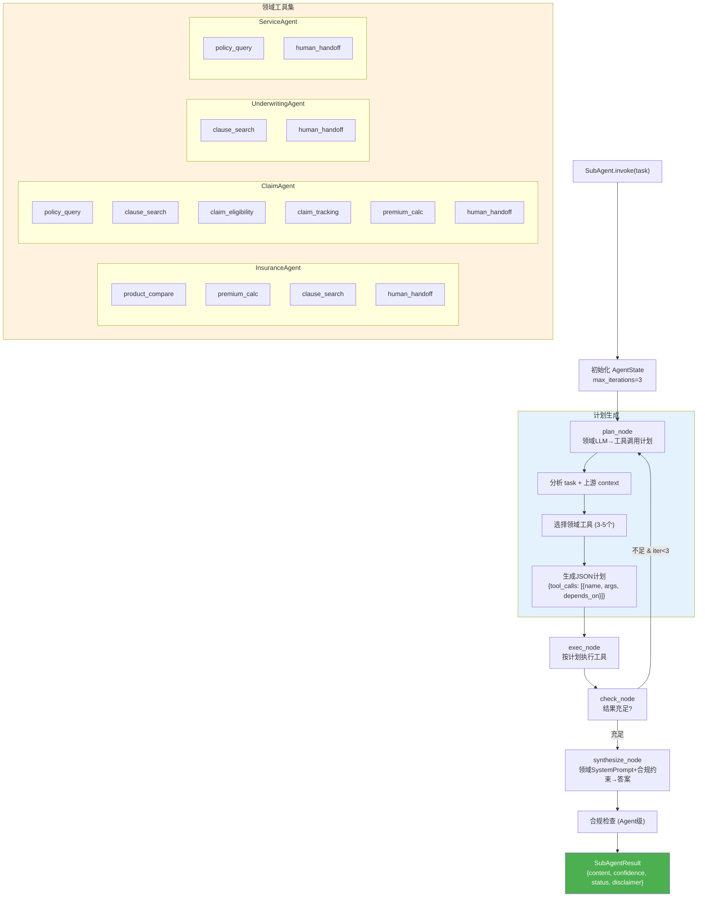

## 图5: RAG管道详细流程 (12个阶段)

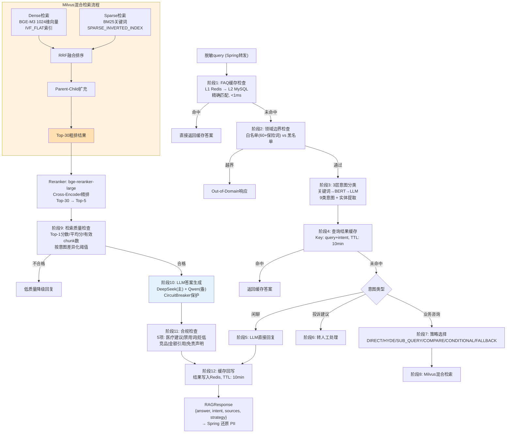

## 图6: 文档摄入管道

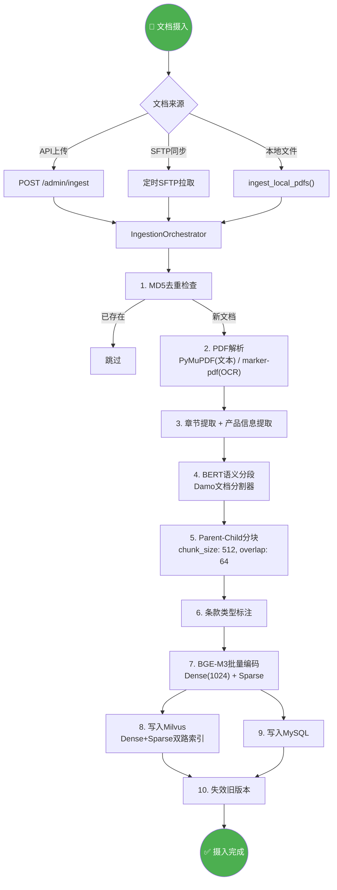

## 图7a: 长记忆 — MySQL 用户画像构建

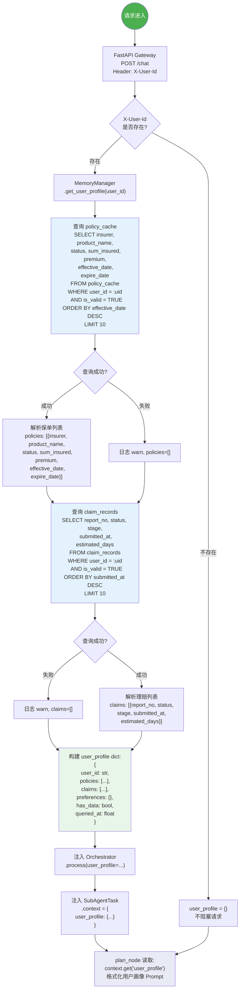

## 图7b: 短记忆 — RedisSaver Checkpoint 状态持久化

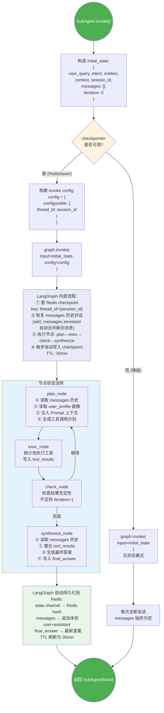

## 图7c: 记忆时序 — 多轮对话端到端流转

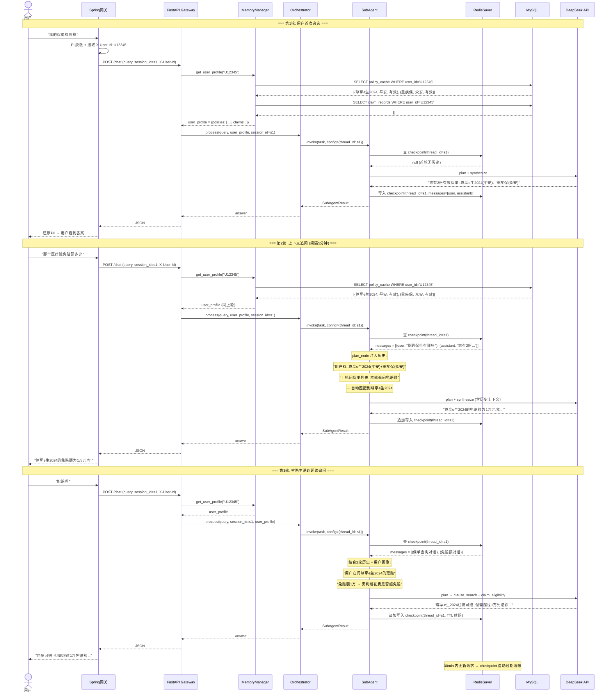

## 图8: 系统架构与外部依赖

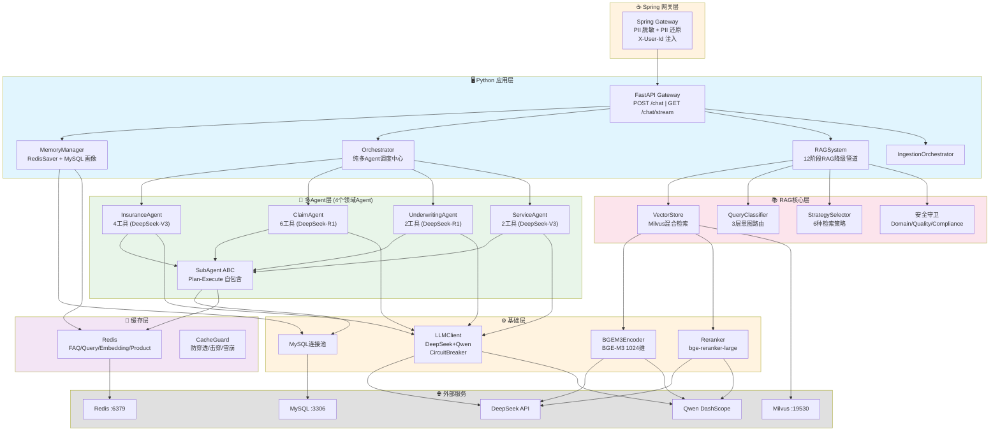

## 图9: 安全与合规管道 (Python侧)

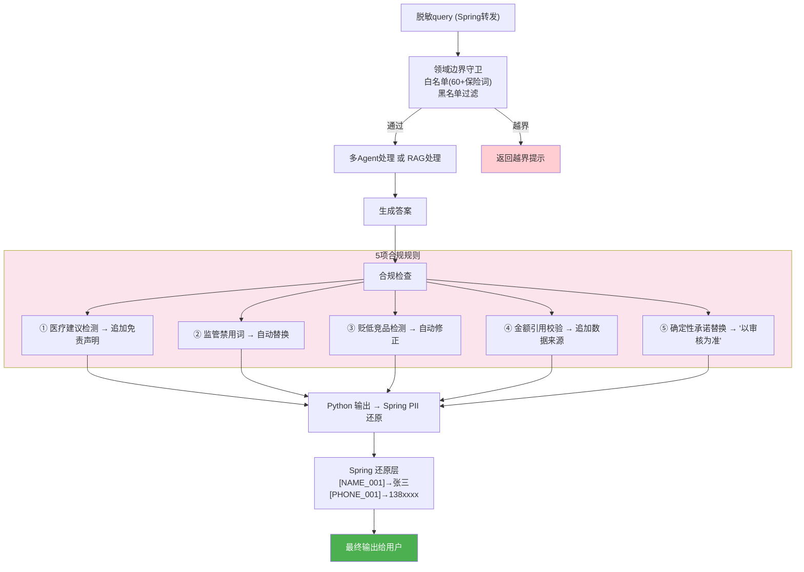

## 图10: 意图→多Agent路由对照表

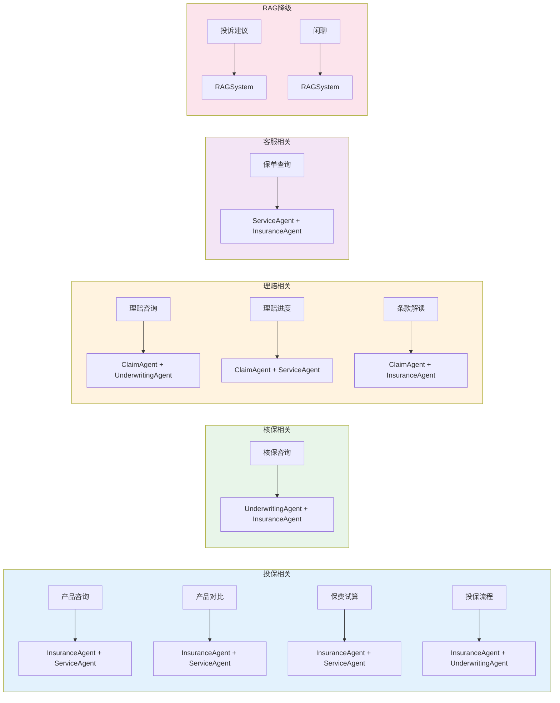

---

## 变更记录

| 版本 | 变更 |
|------|------|
| v3.0 | 删除 `agent/graph.py`，纯多Agent架构，统一 multi_agent 路由 |
| v3.1 | PII 脱敏/还原移至 Spring 网关，RAG 管道 14→12 阶段 |
| v3.2 | 新增长短记忆: RedisSaver Checkpoint + MySQL 用户画像，支持多轮对话 |

## 关键文件索引

| 模块 | 核心文件 | 职责 |
|------|---------|------|
| 入口 | `gateway/app.py` | FastAPI, X-User-Id 提取, user_profile 构建 |
| 记忆 | `agent/memory.py` | MemoryManager: RedisSaver checkpointer + MySQL 用户画像 |
| 编排 | `agent/orchestrator.py` | 纯多Agent调度中心, user_profile 注入 |
| 智能体 | `agent/sub_agents/*.py` | 4个领域Agent, Plan-Execute + RedisSaver 持久化 |
| 基类 | `agent/sub_agents/base.py` | SubAgent ABC, checkpoint 集成, 对话历史注入 |
| 工具 | `agent/tools/all_tools.py` | 7个LangChain工具, 按领域分配 |
| 状态 | `agent/state.py` | AgentState/SubAgentTask/OrchestratorState |
| RAG | `rag_qa/core/rag_system.py` | **12阶段** RAG降级管道 |
| 向量库 | `rag_qa/core/vector_store.py` | Milvus混合检索 |
| 分类器 | `rag_qa/core/query_classifier.py` | 3层意图路由 |
| 编码器 | `base/encoder.py` | BGE-M3, Dense(1024)+Sparse |
| 排序器 | `base/reranker.py` | bge-reranker-large |
| LLM | `base/llm_client.py` | DeepSeek+Qwen, CircuitBreaker |
| 摄入 | `rag_qa/ingestion/ingestion_orchestrator.py` | PDF→分块→编码→入库 |
| 缓存 | `cache/*.py` | Redis三级缓存 |
| 配置 | `config/settings.py` | 全局配置单例 |
