# 保险多保司 RAG 智能问答系统 — Mermaid 架构图集

---

## 1. 总体架构全景图

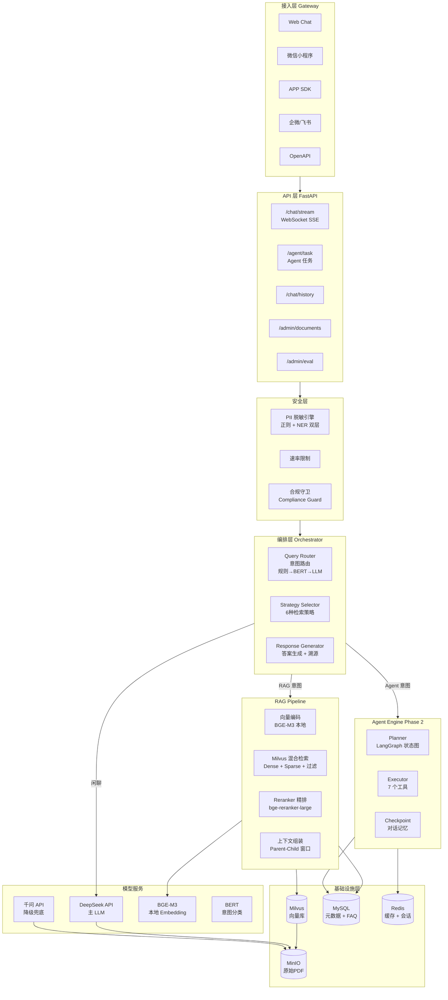

---

## 2. 部署架构 — 本地/云端分工

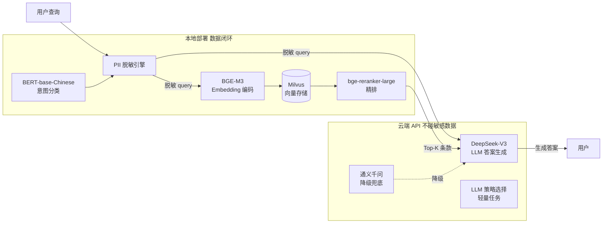

---

## 3. Query 处理主流程

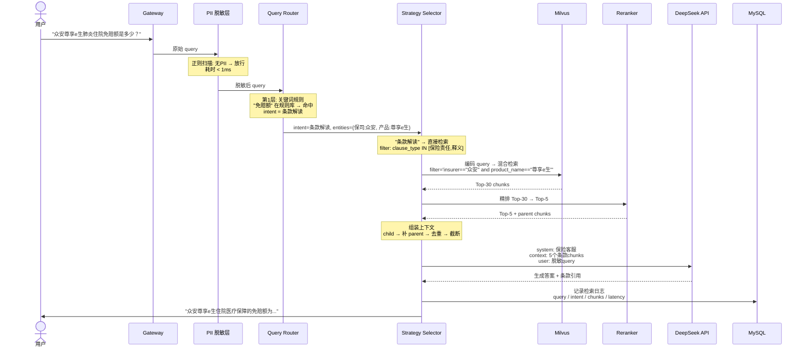

---

## 4. Query Router — 三层意图路由

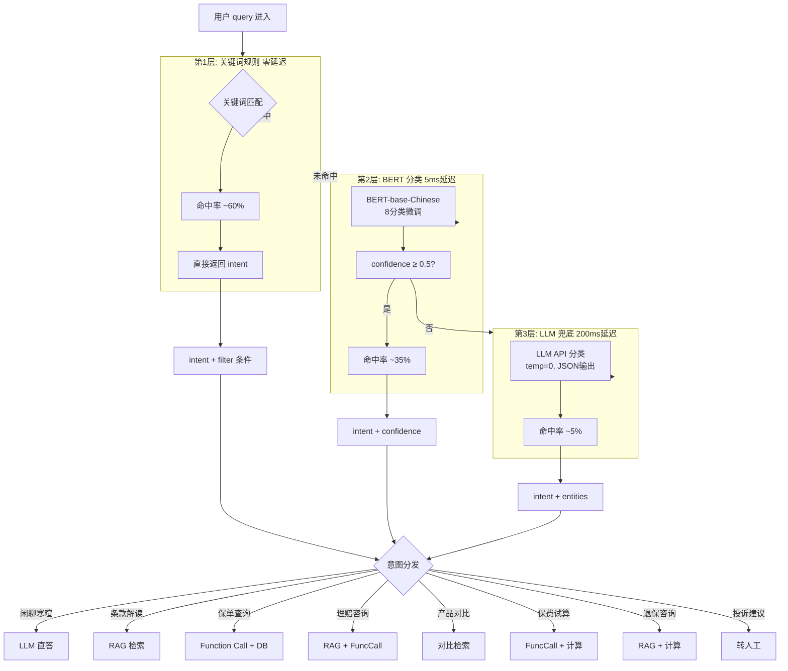

---

## 5. 6 种检索策略路由

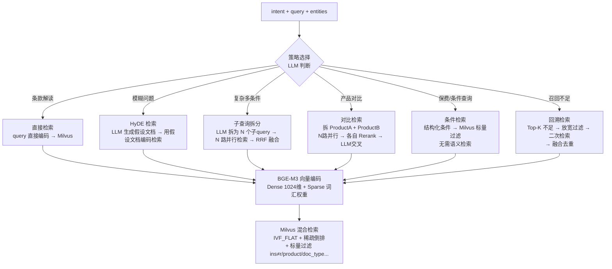

---

## 6. Milvus 多维过滤检索

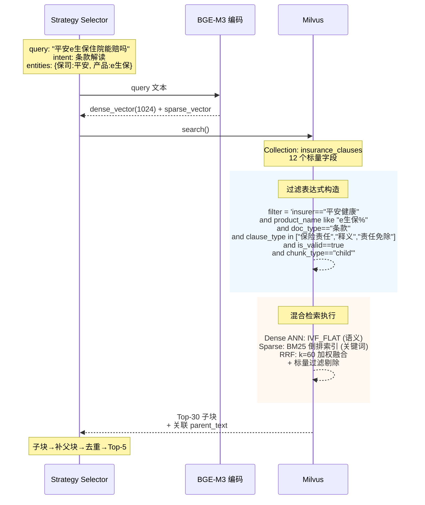

---

## 7. PII 脱敏完整链路

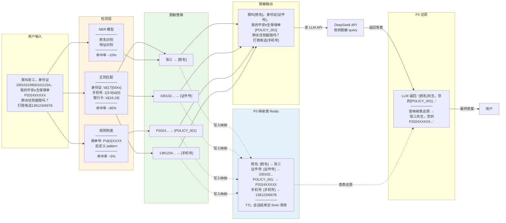

---

## 8. 数据摄取管道 — PDF → Milvus

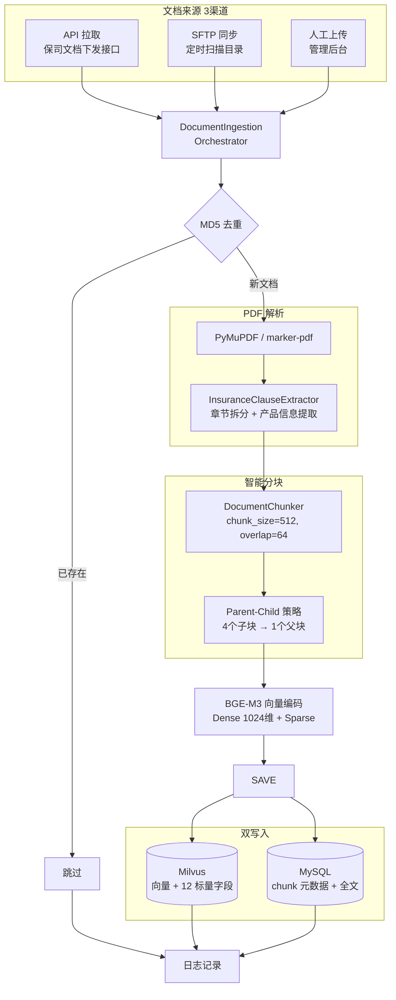

---

## 9. Parent-Child 分块与检索策略

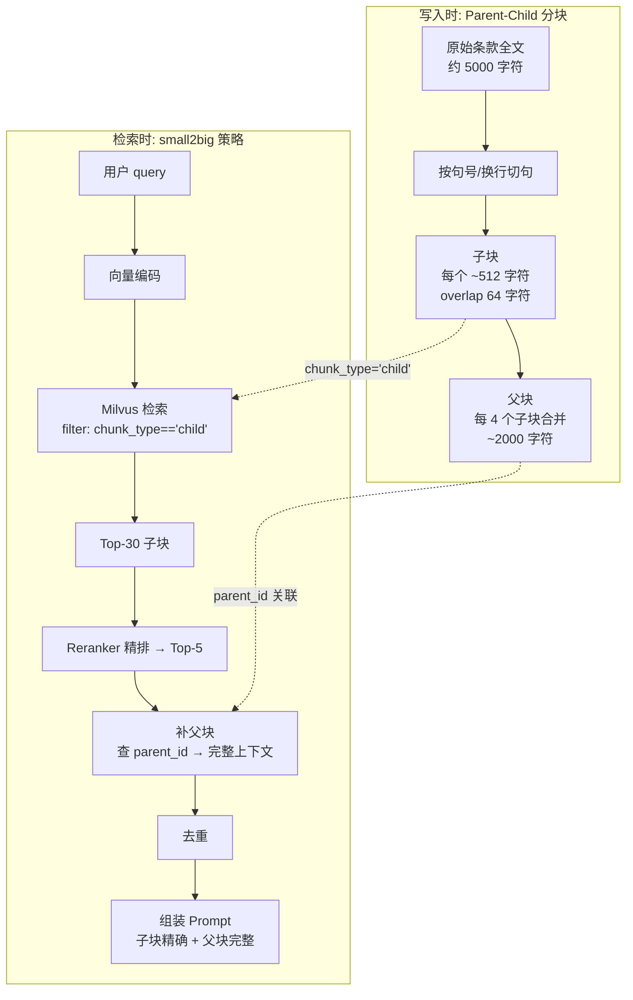

---

## 10. 合规守卫规则

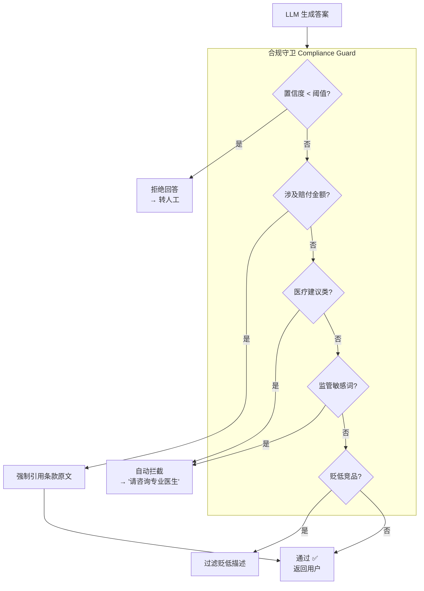

---

## 11. LLM API 混合部署 — 主备切换

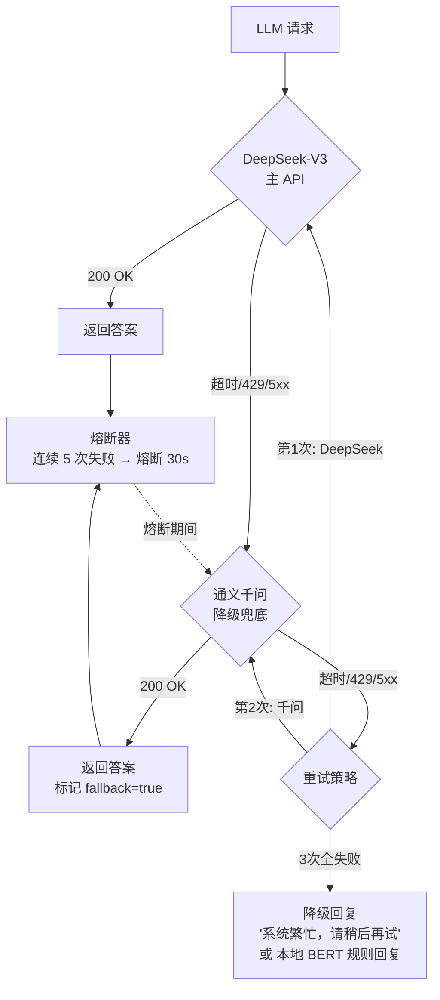

---

## 12. 端到端延迟分解

```mermaid
gantt
    title 单次查询端到端延迟分解 ~350ms
    dateFormat X
    axisFormat %s

    section 安全
    PII脱敏          :pii, 0, 1
    section 路由
    关键词规则       :rule, 0, 1
    BERT意图分类     :bert, 1, 6
    section 检索
    LLM策略选择      :strategy, 1, 201
    BGE-M3编码       :encode, 6, 26
    Milvus混合检索   :milvus, 26, 56
    Reranker精排     :rerank, 56, 66
    section 生成
    上下文组装       :context, 66, 67
    LLM生成答案      :gen, 67, 317
    PII还原          :restore, 317, 318
    section 返回
    响应返回         :done, 318, 320
```

---

## 使用说明

在支持 Mermaid 的编辑器（VS Code + Mermaid 插件、Typora、Obsidian、GitHub）中可直接渲染。

或在浏览器中打开：https://mermaid.live 粘贴代码预览。
